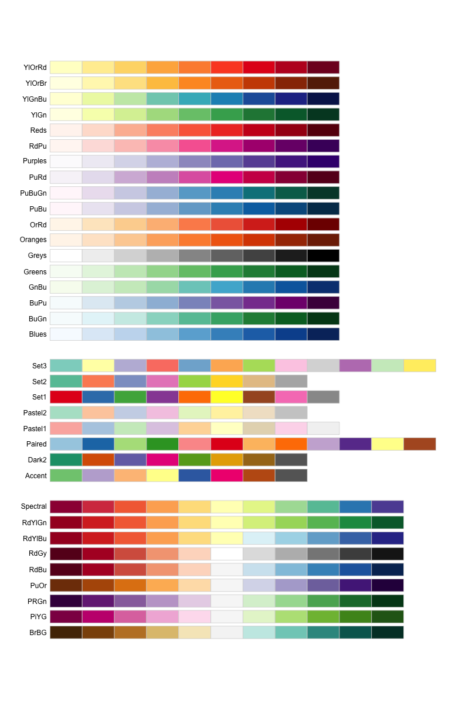

참조: [Data Visualization with ggplot2::Cheat Sheet "Scales"](https://rstudio.github.io/cheatsheets/html/data-visualization.html#scales)

#### 축척 함수 개요

```{r}
library(ggplot2)
c <- ggplot(mpg, aes(hwy))
d <- ggplot(mpg, aes(fl))
e <- ggplot(mpg, aes(cty, hwy))
n <- d + geom_bar(aes(fill = fl))
n
```

```{r}
n + scale_fill_manual(
  values = c("skyblue", "royalblue", "blue", "navy"),
  limits = c("d", "e", "p", "r"),
  breaks = c("d", "e", "p", "r"),
  name = "fuel",
  labels = c("D", "E", "P", "R")
)
```

#### 범용 축척 함수

- scale_*_continious(): 연속값을 시각요소에 대응
- scale_*_discrete(): 이산값을 시각요소에 대응
- scale_*_binned(): 연속값을 이산 빈에 대응
- scale_*_identify(): 데이터 값을 시각요소에 대응
- scale_*_manual(values = c()): 이산값을 개별적으로 지정된 기각요소에 대응
- scale_*_date(date_labels = "%m/%d", date_breaks = "2 weeks"): 데이터 값을 날짜로 처리
- scale_*_datetime(): 데이터 값을 날짜・시간으로 처리


::: {.callout-tip}

## date time lable

    > strptime?     # 도움말 화면 출력

:::


#### 축 위치 축척 함수: scale_x_* 또는 scale_y_*

- scale_x_log10(): log10 축척으로 적용
- scale_x_reverse(): 방향을 반대로 적용
- scale_x_sqrt(): 제곱근 축척으로 적용

#### 색상 및 채우기 축척 함수 (이산 변수)

- scale_fill_brewer(palette = <palette>): ColorBrewer 파레트 색상 적용
- scale_fill_grey(start = 0.1, end = 0.8, na.value = "red"): 회색 그래디언트 색상 적용

```{r}
n + scale_fill_brewer(palette = "Blues")
```



\

```{r}
n + scale_fill_grey(start = 0.2, end = 0.8, na.value = "red")
```

#### 색상 및 채우기 축척 함수 (연속 변수)

```{r}
o <- c + geom_dotplot(aes(fill = after_stat(x)))
o
```

##### scale_fill_distiller()

- 컬러 파레트 적용

```{r}
o + scale_fill_distiller(palette = "Blues")
```

##### scale_fill_gradiant()

- 두가지 색상 그라디언트 적용

```{r}
o + scale_fill_gradient(low = "red", high = "yellow")
```

##### scale_fill_gradiant2()

- 발산하는 색상 그라디언트 적용

```{r}
o + scale_fill_gradient2(low = "red", high = "blue", mid = "white", midpoint = 25)
```

##### scale_fill_gradiantn()

- n 색상 그라디언트 적용

```{r}
o + scale_fill_gradientn(colors = topo.colors(6))
```

##### 기타 함수

- rainbow()
- heat.colors()
- terrain.colors()
- cm.colors()
- RColorBrewer::brewer.pal()


#### 모양 및 크기 축척 함수

```{r}
p <- e + geom_point(aes(shape = fl, size = cyl))
p
```

##### scale_shape(), scale_size()

- 이산값을 묘양과 크키 시각요소에 적용

```{r}
p + scale_shape() + scale_size()
```

##### scale_shape_manual()

- 이산값을 특정 모양 값에 적용

```{r}
p + scale_shape_manual(values = c(3:7))
```

##### scale_radius()

- 값을 모양의 반경에 적용

```{r}
p + scale_radius(range = c(1, 6))
```

##### scale_size_area()

- `scale_size()`와 유사하나 0 값을 크기 0에 적용

```{r}
p + scale_size_area(max_size = 6)
```
